#  Salford Educational App

A full-stack mobile learning platform built with **React Native (Expo)** and **.NET 8 Web API**.  
It allows administrators to manage courses, lessons, and categories while students can explore, subscribe, and watch lessons securely with integrated (dummy) Stripe payments.

---

##  Features

### Student App
- Secure login & registration  
- Browse categories and courses  
- Course details with video lessons  
- Subscription system linked with Stripe dummy gateway  
- User profile management  
- Offline-ready design (future support)

### Admin Portal (API)
- Role-based authentication using JWT  
- Full CRUD for courses, lessons, categories, users  
- File uploads to `wwwroot/uploads` (images, videos, etc)  
- Unlimited file size upload handling  
- Subscription tracking with start/end dates and payment IDs  

---

## 🏗️ Tech Stack

| Layer | Technology |
|-------|-------------|
| **Frontend** | React Native (Expo), TypeScript, React Hooks, NativeWind (future) |
| **Backend** | ASP.NET Core 8 Web API |
| **Database** | Microsoft SQL Server |
| **Storage** | Local file system (`wwwroot/uploads`) |
| **Auth** | JWT Bearer Tokens with role-based access |
| **Payments** | Stripe (development / test mode) |
| **State Management** | React Hooks, AsyncStorage |
| **Navigation** | Expo Router |
| **Video Player** | expo-av |

---

---

## ⚙️ Setup Instructions

### 1️⃣ Backend (.NET 8 API)

#### Prerequisites
- .NET 8 SDK  
- SQL Server (local or remote)
- Visual Studio / VS Code

#### Steps
1. Clone the repo  
   ```bash
   git clone https://github.com/yourusername/salford-educational-app.git
   cd salford-educational-app/backend

-----------------------
Update your appsettings.json connection string:

"ConnectionStrings": {
  "DefaultConnection": "Server=localhost;Database=Salford1;Trusted_Connection=True;TrustServerCertificate=True"
}
-----------------------------
Run migrations and start:

dotnet ef database update
dotnet run
-----------------------------------
http://localhost:5252
------------------------------------------------
Steps

1)Go to the frontend folder

2)cd frontend/SalfordApp


3)Install dependencies

4)npm install


5)Create .env or update /constants/config.ts

6)export const API_BASE_URL = "http://localhost:5252/api"


7)Start the app

8)npx expo start

Stripe Dummy Payment Integration

Uses Stripe Test Mode for subscriptions

On the subscription screen, users simulate a payment using dummy test cards

No real transactions occur

Backend stores:

Subscriptions
├── Id
├── UserId
├── CourseId
├── PaymentId
├── StartDate
├── EndDate
└── Status

 API Overview
| Method | Endpoint                       | Description                        |
| ------ | ------------------------------ | ---------------------------------- |
| `POST` | `/api/users/login`             | User login                         |
| `POST` | `/api/users/register`          | Register user                      |
| `GET`  | `/api/courses`                 | Get all courses                    |
| `GET`  | `/api/courses/{id}`            | Get course details                 |
| `POST` | `/api/admin/courses`           | Create course *(Admin only)*       |
| `POST` | `/api/admin/lessons`           | Upload lesson video *(Admin only)* |
| `POST` | `/api/subscriptions`           | Subscribe with Stripe payment      |
| `GET`  | `/api/subscriptions/user/{id}` | Get user subscriptions             |

 Database Schema (Key Tables)
| Column      | Type     |
| ----------- | -------- |
| Id          | int      |
| Title       | nvarchar |
| Description | nvarchar |
| Price       | decimal  |
| CategoryId  | int      |
| ImageUrl    | nvarchar |
---------------------------------------------------
## 📱 App Screenshots

### 🧭 Splash & Onboarding
<p align="center">
  
  
  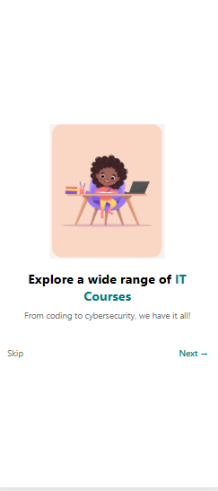
  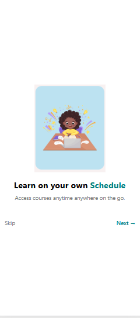
</p>

---

### 🔐 Authentication
<p align="center">
  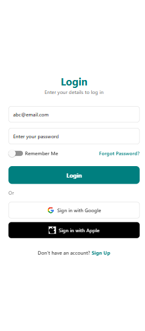
  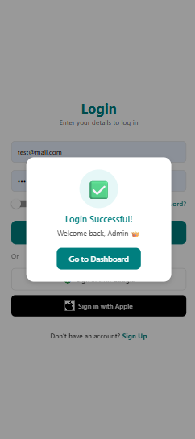
  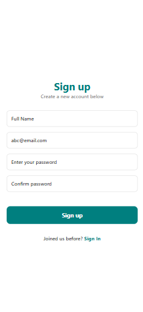
  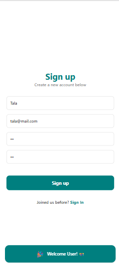
</p>

---

### 🏠 Student Dashboard
<p align="center">
  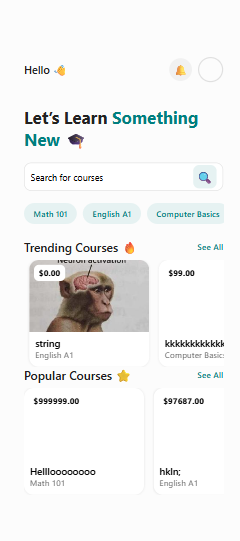
  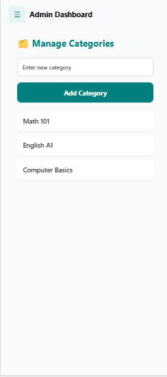
  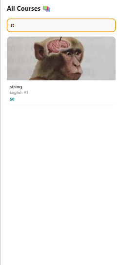
  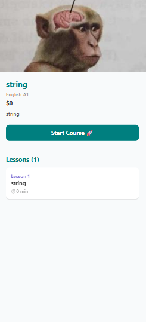
</p>

---

### 🎓 Lessons & Subscriptions
<p align="center">
  
  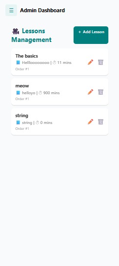
</p>

---

### 👤 Profile & Settings
<p align="center">
  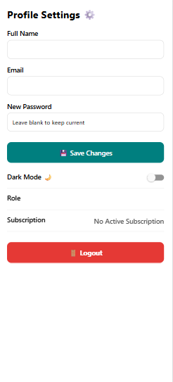
  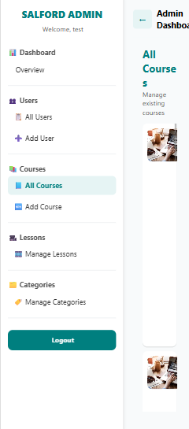
</p>

---

### ⚙️ Admin Dashboard
<p align="center">
  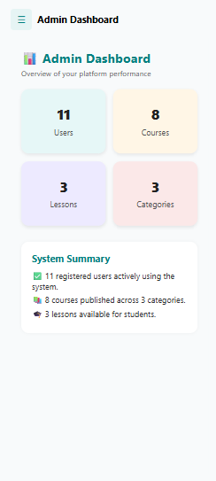
  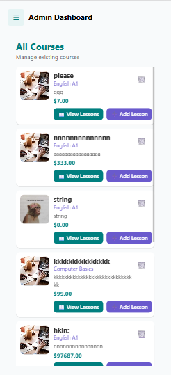
  
  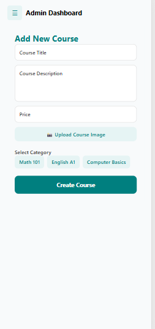
  
  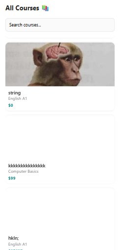
  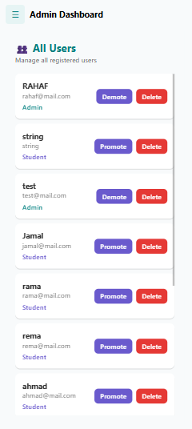
</p>

